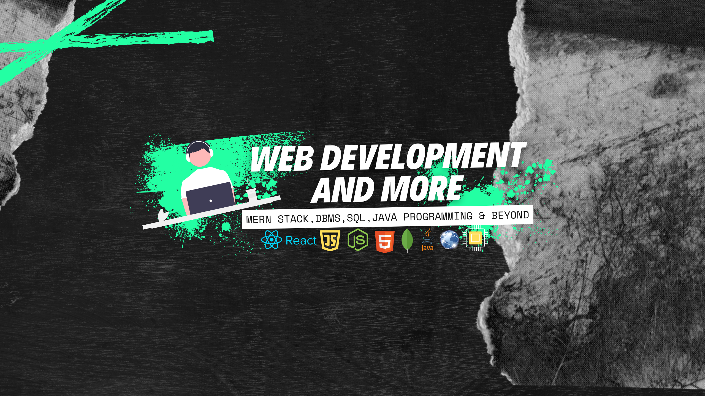

 &nbsp;

- 🔭 I’m a recent graduate and a MERN stack developer.
- 🌱 I’m passionate about Software Engineering and Software Development.
- 🏆 I’m striving to enhance my skills and knowledge in these areas.
- 📺 I’m working on growing my presence on YouTube and Instagram, where I teach web development and more.
- ⚡ Fun fact: I enjoy reading books and playing football.

## 💡 A Quote:

## 💻 My Tech Stack:

## 🏆 My Stats:

    &nbsp;&nbsp;
    &nbsp;&nbsp;

