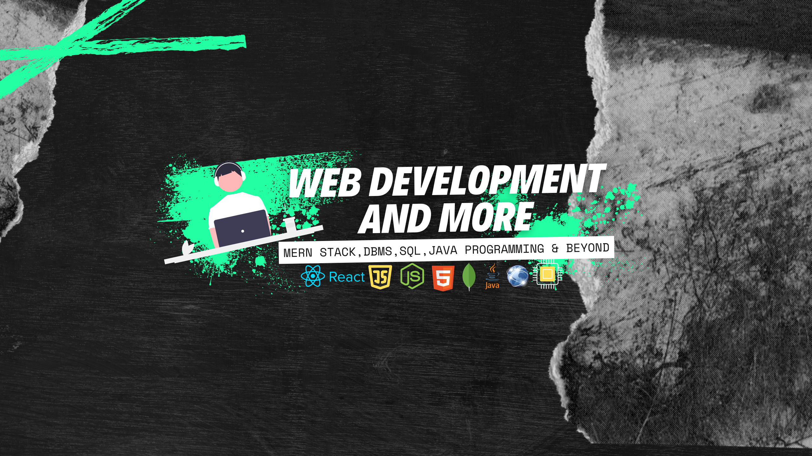

  

## 👋 Hello, I'm Farhan!

I'm a **Full-Stack Developer and Technical Content Creator** focused on building practical software applications across modern web development, backend engineering, and AI.

I work with **Java, Spring Boot, React, Python, FastAPI, PostgreSQL, and AI/ML technologies**, building applications that connect modern software engineering with real-world problems.

My engineering background in **Electronics, Automation, PLC/SCADA, and IoT** also gives me a strong foundation for developing software solutions for industrial and intelligent systems.

🎥 Through **FormulaC Coder**, I create programming and technology content focused on making complex concepts practical and easy to understand.

---

## 💻 Tech Stack

### Backend & Programming

### Frontend

### Database & Development Tools

### AI / Machine Learning

**AI/ML • LLMs • RAG • Embeddings • Vector Search • AI APIs • Machine Learning**

### Engineering & Automation

**PLC • SCADA • HMI • IoT • Embedded Systems • Industrial Automation**

---

## 🚀 Featured Projects

### 🤖 AI SQL Assistant

A full-stack AI application that converts natural-language questions into SQL queries and executes them against a PostgreSQL database.

**React • Spring Boot • PostgreSQL • LLM API • REST API**

---

### ⚙️ Real-Time Equipment Failure Prediction Platform

A predictive-maintenance platform combining real-time sensor data, machine learning, and a full-stack monitoring dashboard to identify potential equipment failures.

**React • Spring Boot • Python • FastAPI • Machine Learning • PostgreSQL**

**Architecture:**

`React → Spring Boot → PostgreSQL → FastAPI ML Service`

---

### 🎙️ PronounceAI

An AI-powered pronunciation assessment platform that processes speech and provides pronunciation analysis and feedback.

**React • Spring Boot • Python • FastAPI • Whisper • AI/ML**

---

## 🎥 FormulaC Coder

I create programming and technology content covering:

* Full-Stack Web Development
* Java & Spring Boot
* React
* Python & FastAPI
* AI / Machine Learning
* Generative AI & LLMs
* Practical Software Development

🎬 [YouTube — FormulaC Coder](https://www.youtube.com/@formulaC_Coder2804)

---

## 📊 GitHub Stats

    
    &nbsp;&nbsp;
    

---

### Build. Explain. Share. Repeat.

